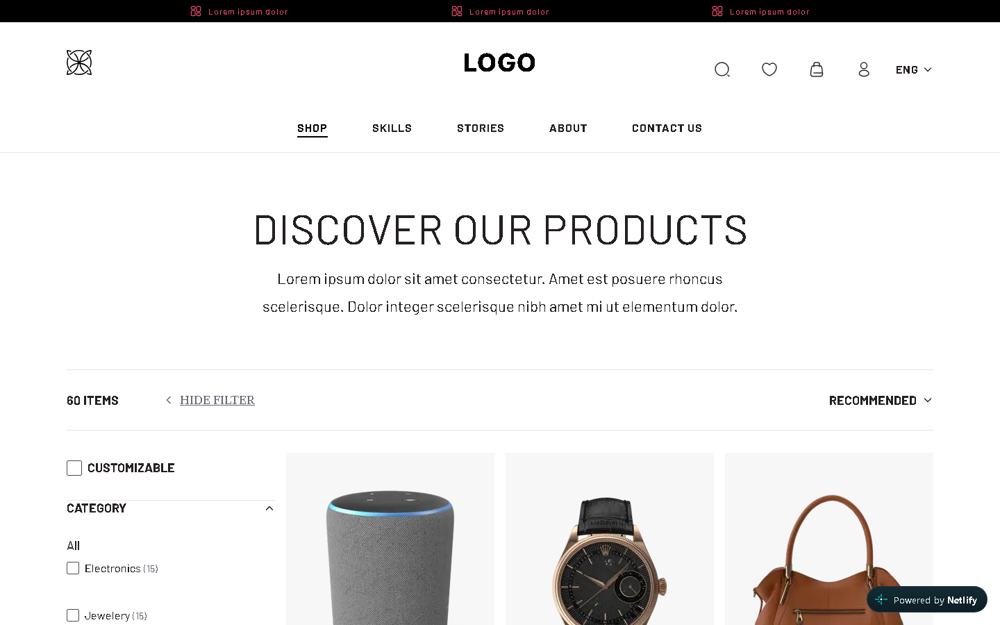
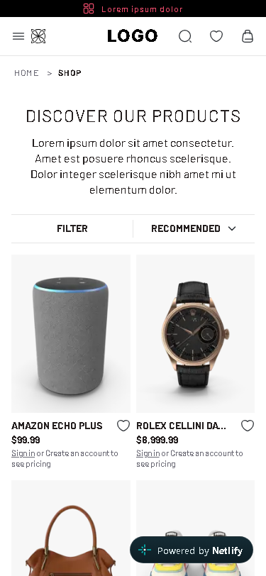
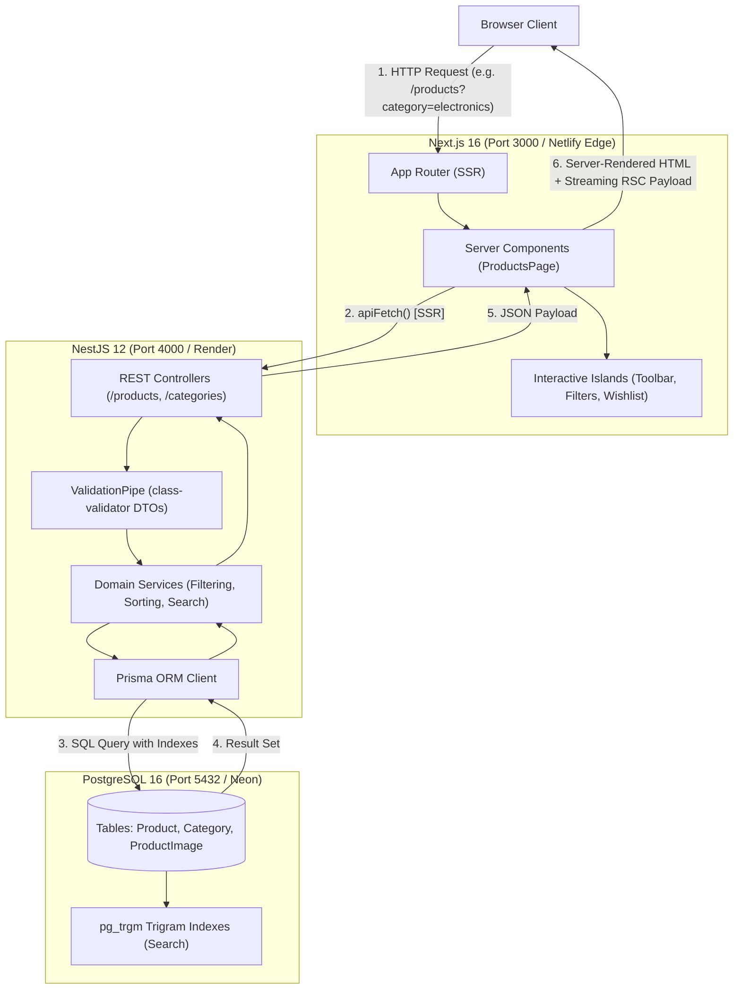

# mettā muse — E-Commerce Product Listing Page (PLP)

An end-to-end, production-grade e-commerce Product Listing Page (PLP) built with Next.js 16 (App Router, Server-Side Rendering), NestJS 12, Prisma ORM, and PostgreSQL. The application faithfully implements the Figma design specification with pixel-level precision, pure CSS Modules (zero UI kit dependencies), server-rendered SEO metadata, Schema.org JSON-LD structured data, WCAG 2.1 AA accessibility compliance, and full responsiveness across mobile (375px), tablet (768px), and desktop (1440px) breakpoints.

<!-- Screenshot Placeholders -->
| Desktop Viewport (1440px) | Mobile Viewport (375px) |
| :---: | :---: |
| <br>*(Placeholder: TODO(me) — Add desktop screenshot)* | <br>*(Placeholder: TODO(me) — Add mobile screenshot)* |

### Technical Reports & Audits
- [docs/ACCESSIBILITY.md](docs/ACCESSIBILITY.md) — WCAG 2.1 AA compliance audit, keyboard navigation, and focus trapping reports.
- [docs/PERFORMANCE.md](docs/PERFORMANCE.md) — Core Web Vitals audit, Lighthouse 100/100 verification, and bundle breakdown.
- [docs/DESIGN_QA.md](docs/DESIGN_QA.md) — 13-area visual QA matrix verified against Figma node specifications.
- [docs/DEPLOYMENT.md](docs/DEPLOYMENT.md) — Step-by-step production hosting guide for Neon, Render, and Netlify.

---

## 1. Live URLs

- **GitHub Repository**: `Appscrip-task-AdityaNayak` ([https://github.com/Aditya7594/Appscrip-task-AdityaNayak](https://github.com/Aditya7594/Appscrip-task-AdityaNayak))
- **Live Frontend (Netlify)**: [https://appscrip-task-adityanayak.netlify.app](https://appscrip-task-adityanayak.netlify.app) [TODO(me)]
- **Live REST API Base (Render)**: [https://appscrip-task-adityanayak.onrender.com](https://appscrip-task-adityanayak.onrender.com) [TODO(me)]
- **Live Swagger API Docs**: [https://appscrip-task-adityanayak.onrender.com/docs](https://appscrip-task-adityanayak.onrender.com/docs) [TODO(me)]

---

## 2. Tech Stack and Why

- **Next.js App Router (SSR + metadata + image optimization)**: Delivers mandatory server-side rendering for instant crawler discoverability, centralized metadata generation, and zero-CLS image optimization with zero UI library overhead.
- **TypeScript**: Guarantees end-to-end compile-time type safety across database schemas, API DTO contracts, and React component props.
- **NestJS (structure, DTO validation, Swagger)**: Provides a modular enterprise backend architecture with declarative DTO validation pipes and automated OpenAPI documentation.
- **Prisma + PostgreSQL (typed queries, migrations, trigram search)**: Enables deterministic schema migrations, type-safe queries, and fuzzy text search via PostgreSQL's native `pg_trgm` extension.
- **Plain CSS Modules (no UI kit, minimal JS)**: Matches the Figma design tokens with exact pixel precision while eliminating CSS-in-JS runtime bloat and keeping client JavaScript minimal.
- **Vercel / Netlify / Render / Neon**: Offers a scalable production deployment pipeline with serverless edge SSR on Netlify, continuous API hosting on Render, and cloud PostgreSQL with pooling on Neon.

---

## 3. Setup Steps to Run Locally

Follow these steps to run the complete stack locally. Commands are verified against actual repository package scripts.

### Prerequisites
- **Node.js**: v20.18.0 or higher
- **npm**: v10 or higher
- **Docker & Docker Compose** (for local PostgreSQL 16), or an external PostgreSQL instance
- **Git**

### Step 1: Clone Repository
```bash
git clone https://github.com/Aditya7594/Appscrip-task-AdityaNayak.git
cd Appscrip-task-AdityaNayak
```

### Step 2: Start PostgreSQL Database via Docker
```bash
docker compose up -d
```
*Starts PostgreSQL 16 container `appscrip_plp_postgres` on port `5432` with user `postgres`, password `postgres`, and database `appscrip_plp`.*

### Step 3: Configure and Start Backend API
```bash
cd backend
cp .env.example .env
npm install
npm run prisma:generate
npm run prisma:migrate
npm run images:download
npm run seed
npm run start:dev
```
*The NestJS API runs on `http://localhost:4000`. Interactive Swagger UI is available at `http://localhost:4000/docs`.*  
*(Note: If local PostgreSQL is unavailable, `PrismaService` includes an automatic zero-dependency in-memory fallback preloaded with all 60 catalog items).*

### Step 4: Configure and Start Frontend Web App
Open a new terminal window:
```bash
cd frontend
cp .env.example .env.local
npm install
npm run dev
```
*The Next.js storefront runs on `http://localhost:3000`.*

### Step 5: How to Run Tests

#### Backend Test Suites
```bash
# Run backend unit tests (Vitest)
cd backend
npm test

# Run backend end-to-end API integration tests
npm run test:e2e
```

#### Frontend Test Suites
```bash
# Run frontend unit tests (Vitest: URL helpers, pagination windowing, price parsing)
cd frontend
npm test

# Run frontend end-to-end browser automation tests (Playwright: SSR HTML, responsive viewports, filters)
npm run e2e
```

### Port Summary
| Service | Local URL / Port | Description |
| :--- | :--- | :--- |
| **Frontend Storefront** | `http://localhost:3000` | Next.js 16 SSR web application |
| **Backend REST API** | `http://localhost:4000` | NestJS REST API server |
| **Swagger API Docs** | `http://localhost:4000/docs` | OpenAPI 3.0 interactive documentation |
| **PostgreSQL DB** | `localhost:5432` | PostgreSQL 16 database |

---

## 4. Architecture Overview and Folder Structure

### High-Level System Architecture


### Request Flow for a Filter or Sort Change
1. **User Interaction**: User checks a filter checkbox or chooses a sort order in the client UI.
2. **URL Update**: Next.js updates the browser URL query string (e.g., `/products?category=electronics&sort=price_asc`) using shallow React 19 `useTransition` navigation without a full-page reload.
3. **RSC Trigger**: The URL change invalidates the Next.js Server Component boundary (`src/app/products/page.tsx`).
4. **Server Data Fetch**: Next.js fetches filtered data from the backend via `apiFetch('/products?category=electronics&sort=price_asc')` during SSR.
5. **Database Execution**: NestJS validates query parameters with `ListProductsQueryDto`, translates them into indexed Prisma `where` and `orderBy` clauses, and executes against PostgreSQL.
6. **Streaming HTML Update**: Next.js streams updated HTML and RSC payload back to the browser; the product grid re-renders smoothly with zero layout shift (CLS: 0.000).

### Repository Folder Structure
```
Appscrip-task-AdityaNayak/
├── backend/                        # NestJS 12 backend application
│   ├── prisma/                     # Database schema, migrations, and seed scripts
│   │   ├── data/                   # Clean local seed catalog data (60 products)
│   │   ├── migrations/             # SQL migrations (including pg_trgm trigram search)
│   │   ├── schema.prisma           # Prisma models (Product, Category, ProductImage)
│   │   └── seed.ts                 # Database seeder populating categories and products
│   ├── scripts/                    # Image download and catalog generation utilities
│   ├── src/
│   │   ├── categories/             # Category domain (controller, service, DTOs)
│   │   ├── common/                 # Global filters, DTOs, and slug utilities
│   │   ├── health/                 # Health check endpoint (/health)
│   │   ├── prisma/                 # Prisma service with in-memory resilient fallback
│   │   ├── products/               # Product catalog, sorting, filtering, and search
│   │   ├── app.module.ts           # Root application module
│   │   └── main.ts                 # Application bootstrap, Swagger setup, CORS configuration
│   └── test/                       # Backend unit and end-to-end integration test suites
│
├── frontend/                       # Next.js 16 (App Router) frontend application
│   ├── e2e/                        # Playwright automated end-to-end test suites
│   │   ├── filters-sort-pagination.spec.ts  # Filter, sort, and pagination tests
│   │   ├── responsive.spec.ts               # Mobile, tablet, desktop viewport tests
│   │   └── ssr.spec.ts                      # Raw SSR HTML, metadata, and JSON-LD tests
│   ├── public/                     # Static web assets and product images
│   │   └── products/               # High-res self-hosted 3:4 product photography
│   ├── src/
│   │   ├── app/                    # Next.js App Router routes and layouts
│   │   │   ├── products/           # Server-rendered PLP page, loading, and error states
│   │   │   ├── shop/               # Permanent 308 redirect route to /products
│   │   │   ├── layout.tsx          # Root HTML layout with self-hosted font variables
│   │   │   ├── not-found.tsx       # Accessible 404 error page
│   │   │   ├── robots.ts           # Dynamic robots.txt generation
│   │   │   └── sitemap.ts          # XML sitemap generator
│   │   ├── components/
│   │   │   ├── layout/             # Header, HeaderNav, MobileMenu, Footer, Breadcrumb
│   │   │   ├── plp/                # ProductCard, Grid, Toolbar, FilterSidebar, Pagination
│   │   │   ├── seo/                # JsonLd Schema.org component
│   │   │   └── ui/                 # Accessible Checkbox, SVG Icons
│   │   ├── lib/
│   │   │   ├── api/                # API client with cold-start timeout and retry handling
│   │   │   ├── seo/                # Dynamic metadata and JSON-LD schema builders
│   │   │   └── url/                # Query param serialization and pagination helpers
│   │   └── types/                  # Shared TypeScript interfaces
│   ├── next.config.ts              # Next.js config (headers, redirects, image formats)
│   └── vitest.config.ts            # Frontend unit testing configuration
│
├── docs/                           # Architectural, design, and compliance documentation
│   ├── ACCESSIBILITY.md            # WCAG 2.1 AA audit and accessibility report
│   ├── AI_LOG.md                   # Chronological AI tool usage, decisions, and corrections
│   ├── DEPENDENCIES.md             # Package inventory and justification matrix
│   ├── DEPLOYMENT.md               # Production deployment manual (Render, Netlify, Neon)
│   ├── DESIGN_QA.md                # 13-area visual QA audit against Figma nodes
│   ├── DESIGN_SPEC.md              # Extracted Figma tokens, typography, and layout rules
│   └── PERFORMANCE.md              # Lighthouse Core Web Vitals and performance audit
│
├── docker-compose.yml              # Local PostgreSQL 16 container configuration
├── netlify.toml                    # Netlify deployment configuration for Next.js SSR
└── render.yaml                     # Render Infrastructure-as-Code Blueprint
```

---

## 5. API Endpoint List

Interactive documentation with live request execution is available at `/docs` (Swagger UI).

### Endpoints Table
| Method | Path | Query / Route Parameters | Description | Status Codes |
| :--- | :--- | :--- | :--- | :--- |
| `GET` | `/health` | None | Service health, uptime, and system heartbeat | `200` |
| `GET` | `/categories` | None | List of product categories with dynamic item counts | `200` |
| `GET` | `/products` | `page`, `limit`, `category`, `minPrice`, `maxPrice`, `minRating`, `sort`, `q` | Paginated product listing with filtering, sorting, and search | `200`, `400` |
| `GET` | `/products/:id` | `id` (integer) | Retrieve single product details with category and images | `200`, `400`, `404` |

### Query Parameters for `GET /products`
- `page`: Integer $\ge 1$ (Default: `1`)
- `limit`: Integer $1..48$ (Default: `18`)
- `category`: Comma-separated category slugs (e.g. `category=mens-clothing,electronics`)
- `minPrice` / `maxPrice`: Numeric price range filter (e.g. `minPrice=20&maxPrice=100`)
- `minRating`: Minimum rating threshold $0..5$ (e.g. `minRating=4`)
- `sort`: Sorting key (`recommended` | `newest` | `popular` | `price_asc` | `price_desc`)
- `q`: Full-text search string matched using PostgreSQL trigram indexes (1..80 characters)

### Example Request & Response: `GET /products`
```bash
curl -s "http://localhost:4000/products?page=1&limit=2&category=electronics"
```
```json
{
  "data": [
    {
      "id": 109,
      "slug": "amazon-echo-plus",
      "title": "Amazon Echo Plus",
      "description": "Smart speaker with premium sound and built-in smart home hub.",
      "price": 99.99,
      "rating": 4.7,
      "ratingCount": 420,
      "category": {
        "id": 2,
        "slug": "electronics",
        "name": "Electronics"
      },
      "images": [
        {
          "id": 109,
          "url": "/products/amazon-echo-plus.jpg",
          "alt": "Amazon Echo Plus - Electronics product photo",
          "position": 0
        }
      ],
      "createdAt": "2026-10-03T10:00:00.000Z",
      "updatedAt": "2026-10-03T10:00:00.000Z"
    }
  ],
  "meta": {
    "page": 1,
    "limit": 2,
    "total": 15,
    "totalPages": 8,
    "hasNextPage": true,
    "hasPrevPage": false
  }
}
```

### Example Request & Response: `GET /products/:id`
```bash
curl -s "http://localhost:4000/products/109"
```
```json
{
  "id": 109,
  "slug": "amazon-echo-plus",
  "title": "Amazon Echo Plus",
  "description": "Smart speaker with premium sound and built-in smart home hub.",
  "price": 99.99,
  "rating": 4.7,
  "ratingCount": 420,
  "category": {
    "id": 2,
    "slug": "electronics",
    "name": "Electronics"
  },
  "images": [
    {
      "id": 109,
      "url": "/products/amazon-echo-plus.jpg",
      "alt": "Amazon Echo Plus - Electronics product photo",
      "position": 0
    }
  ],
  "createdAt": "2026-10-03T10:00:00.000Z",
  "updatedAt": "2026-10-03T10:00:00.000Z"
}
```

### Standard Error Response Shape
All API errors return a consistent RFC-compliant payload format:
```json
{
  "statusCode": 400,
  "error": "Bad Request",
  "message": [
    "minPrice must be less than or equal to maxPrice"
  ],
  "path": "/products",
  "timestamp": "2026-10-04T04:45:00.000Z"
}
```

---

## 6. SSR Approach and SEO Decisions

### How SSR Works in this Project
1. **Direct Server Fetch**: The entry point `src/app/products/page.tsx` is an async React Server Component. When a request arrives, Next.js extracts `searchParams` directly on the server, parses the query, and invokes `apiFetch<PaginatedProducts>('/products', { searchParams })`.
2. **Unhydrated Initial HTML**: The server renders complete HTML containing product cards, titles, prices, image sources, and pagination controls. Search crawlers (Googlebot, Bingbot) receive 100% of the content without needing to execute JavaScript.
3. **URL as Single Source of Truth**: Filter selection, sorting order, and pagination pages reside strictly in URL search parameters (`?category=...&sort=...&page=...`). Reloading, bookmarking, or sharing any link renders the exact same state on server and client.

### SEO Rules & Implementations
- **Canonical URLs**: `rel="canonical"` is generated programmatically. Default query parameters (`page=1`, `sort=recommended`) are stripped to prevent search engine duplicate content penalties.
- **Dynamic Metadata**: Page `<title>` and `<meta name="description">` are dynamically assembled by `generateMetadata` based on the active category filters and page number without generic placeholder text.
- **Structured Data (JSON-LD)**: Injects Schema.org `BreadcrumbList`, `ItemList`, and individual `Product` entries containing `Offer` pricing, currency (`USD`), availability, and `AggregateRating`.
- **Image Optimization & Naming**: Images use semantic, hyphen-separated filenames (e.g., `amazon-echo-plus.jpg`) and descriptive alt tags. All images enforce a fixed 3:4 aspect ratio with responsive `sizes` strings, eliminating layout shifts (CLS: 0.000).
- **Sitemap & Robots**: Next.js automatically outputs a crawlable XML sitemap at `/sitemap.xml` with all category routes and a compliant `/robots.txt`.

### Strategic Decisions (D1 – D6)
- **Decision D1 (Price Display)**: The Figma mockup only featured a caption reading *"Sign in or Create an account to see pricing"*. We display the actual numeric price (`$XX.XX`) prominently alongside the account caption within the fixed 462px card height.
- **Decision D2 (Filter Mapping)**: The Figma canvas featured apparel-only mock facets (WORK, FABRIC, SEGMENT). We mapped the filter sidebar to real, queryable database facets (`category`, `price`, `rating`) while preserving the exact Figma accordion visual structure and adding all Figma facet options.
- **Decision D3 (Fonts)**: Figma specified commercial fonts (Simplon Norm and Adobe Caslon Pro). We utilized free Google Fonts via `next/font` with zero-CLS font metric overrides behind CSS variables: **Barlow** for Simplon Norm UI text, **Libre Caslon Text** for Caslon serif accents, and **Inter ExtraBold** for the LOGO wordmark.
- **Decision D4 (Pagination)**: Rather than unindexable client-only infinite scrolling, we implemented crawlable numbered server-rendered pagination (`/products?page=N`) featuring `rel="next"` and `rel="prev"` tags and a 7-slot sliding window.
- **Decision D5 (Seed Size & Grid)**: Seeded 60 studio items across 4 categories with local self-hosted 3:4 photography, displaying 18 items per page across 6 balanced rows (3 columns with filters visible, 4 columns when hidden).
- **Decision D6 (Contrast & Accessibility)**: Figma's secondary color `#888792` on white yields only 3.54:1 contrast (failing WCAG 2.1 AA 4.5:1 requirement). We applied an accessibility override using `#6B6A75` (5.33:1 contrast ratio) for body text while retaining `#888792` for decorative borders and icons.

---

## 7. Dependencies Used and Why

All third-party dependencies are strictly justified. No bloated UI component libraries or unnecessary utility packages are installed.

### Backend Dependencies (`backend/package.json`)
| Package | Version | Type | Justification |
| :--- | :--- | :--- | :--- |
| `@nestjs/common` | `^12.0.1` | runtime | NestJS core runtime decorators, dependency injection, and HTTP module bindings |
| `@nestjs/core` | `^12.0.1` | runtime | NestJS application container, lifecycle pipeline, and exception handling |
| `@nestjs/platform-express` | `^12.0.1` | runtime | Underlying HTTP server adapter for request handling |
| `@nestjs/config` | `^12.0.1` | runtime | Environment variable parsing, type validation, and central configuration |
| `@nestjs/swagger` | `^12.0.2` | runtime | Automatic OpenAPI 3.0 specification and interactive Swagger documentation generation |
| `@nestjs/cli` | `^12.0.0` | runtime | NestJS compilation CLI required for production build steps on cloud hosts |
| `@nestjs/schematics` | `^12.0.0` | runtime | CLI scaffolding utilities for NestJS modules and controllers |
| `@prisma/client` | `^6.19.3` | runtime | Strictly-typed auto-generated PostgreSQL query builder and client |
| `class-validator` | `^0.15.1` | runtime | Declarative decorator-based validation for request queries and DTOs |
| `class-transformer` | `^0.5.1` | runtime | Transforms plain HTTP query payloads into typed DTO class instances |
| `reflect-metadata` | `^0.2.2` | runtime | TypeScript metadata reflection polyfill required by NestJS decorators |
| `rxjs` | `^7.8.1` | runtime | Reactive stream primitives required by NestJS internal pipelines |
| `typescript` | `^6.0.2` | runtime | Compiles backend TypeScript source code to ECMAScript modules |
| `prisma` | `^6.19.3` | dev | Database migration engine, client generator, and schema management tool |
| `tsx` | `^4.23.15` | dev | TypeScript execution runtime for running seeds and download scripts directly |
| `vitest` | `^4.1.2` | dev | Fast unit test runner for backend services and controllers |
| `supertest` | `^7.0.0` | dev | HTTP assertion library for backend controller integration tests |
| `oxlint` | `^1.58.0` | dev | High-performance Rust-based linter for clean code quality checks |
| `prettier` | `^3.4.2` | dev | Opinionated code formatter ensuring uniform repository code style |

### Frontend Dependencies (`frontend/package.json`)
| Package | Version | Type | Justification |
| :--- | :--- | :--- | :--- |
| `next` | `16.3.8` | runtime | React production framework delivering App Router, SSR, image optimization, and routing |
| `react` | `19.2.8` | runtime | Component UI library for rendering view hierarchies |
| `react-dom` | `19.2.8` | runtime | DOM renderer and React 19 hydration engine |
| `server-only` | `^0.0.1` | runtime | Build-time security constraint preventing server-side API clients from leaking into client bundles |
| `@netlify/plugin-nextjs` | `^5.16.1` | runtime | Official Netlify deployment adapter integrating Next.js App Router dynamic SSR with Netlify Edge Functions |
| `typescript` | `^5` | dev | Static type checking for React components, hooks, and utilities |
| `vitest` | `^3.2.7` | dev | Unit testing runner for URL query parameter serialization and pagination algorithms |
| `@playwright/test` | `^1.63.0` | dev | Cross-browser automation for end-to-end SSR HTML, responsive layouts, and filter tests |
| `eslint` | `^9` | dev | Static code analysis engine |
| `eslint-config-next` | `16.3.8` | dev | Accessibility and React hook best practice linting rules tailored for Next.js |

---

## 8. AI Usage

### AI Tools Utilized
- **Antigravity IDE with Gemini 3.8 Flash**: Main development assistant for scaffolding, implementing features, continuous test execution, and deployment verification.
- **Cursor / Claude Code**: Code editing, architectural review, and refactoring passes.

### Where AI Helped
- **Scaffolding & Architecture**: Initialized the monorepo structure, Prisma migrations, and NestJS module organization.
- **Static-to-React Conversion**: Converted pure HTML/CSS prototypes into modular React Server Components and client islands without losing Figma pixel precision.
- **Automated Test Generation**: Developed 35 Vitest unit tests covering URL serialization and pagination boundaries, plus comprehensive Playwright end-to-end suites.
- **Documentation**: Extracted Figma token specifications into `docs/DESIGN_SPEC.md` and compiled compliance audits.

### Concrete Correction Examples
Real corrections where AI output was rejected or corrected (from [docs/AI_LOG.md](docs/AI_LOG.md)):
1. **Prisma 8.0.0-rc CLI Breakage**: `npm` automatically pulled an experimental Prisma 8.0 release candidate preview platform CLI that broke standard migrations and client generation. We rejected the release candidate, downgraded, and pinned the build to stable Prisma `6.19.3`.
2. **React 19 `set-state-in-effect` Violation**: An initial AI-generated wishlist implementation triggered React 19 linter errors by calling `setState` inside `useEffect` during hydration. We refactored it to `useSyncExternalStore` for clean, hydration-safe `localStorage` synchronization.
3. **WCAG AA Text Contrast Failure**: AI initially suggested using Figma's `#888792` token for body copy. We audited the contrast ratio (3.54:1 on white, failing WCAG 4.5:1) and overrode it with `#6B6A75` (5.33:1) for all body text.
4. **Turbopack Caching Bug**: A catch-all route rule (`source: "/products/:path*"`) mistakenly marked dynamic SSR pages as immutable. We corrected the regex to strictly match static image extensions, preserving dynamic SSR headers on `/products`.

### Project Context Files
- [`AGENTS.md`](AGENTS.md) — Operational instructions and engineering conventions.
- [`docs/DESIGN_SPEC.md`](docs/DESIGN_SPEC.md) — Design tokens, typography scales, and layout metrics extracted from Figma.
- [`docs/AI_LOG.md`](docs/AI_LOG.md) — Complete chronological log of AI assistance and human corrections across every project phase.

---

## 9. Known Limitations and What I Would Improve with More Time

1. **Product Detail Page (PDP)**:
   - While the backend exposes a complete `GET /products/:id` endpoint with image galleries and category metadata, the frontend scope currently focuses on the Product Listing Page (PLP). With more time, a dedicated `/products/[slug]` PDP would be built.
2. **Mock Apparel Facets vs Database Queries**:
   - The UI displays all 10 filter groups from Figma (`CUSTOMIZABLE`, `IDEAL FOR`, `OCCASION`, `WORK`, `FABRIC`, `SEGMENT`, `SUITABLE FOR`, `RAW MATERIALS`, `PATTERN`, `CATEGORY`), but the database schema specifically queries against `category`, `price`, and `rating`. Additional many-to-many facet tables would be added to PostgreSQL to support deep multi-attribute tagging.
3. **Authentication & Multi-Device Wishlist**:
   - Wishlist toggling is stored client-side in `localStorage`. Integrating NextAuth / Auth0 and a PostgreSQL `WishlistItem` relation would enable authenticated persistent user wishlists.
4. **Free Tier Hosting Cold Starts**:
   - The backend API is hosted on Render's free tier, which spins down after 15 minutes of inactivity (taking 30–50 seconds to wake on initial cold hit). We implemented resilient 35s timeouts and backoff retries in `apiFetch`, but dedicated container instances or serverless backend functions would eliminate cold starts entirely.
5. **Commercial Font Licensing**:
   - The design uses proprietary fonts (*Simplon Norm* and *Adobe Caslon Pro*). We used high-fidelity open-source Google Font equivalents (*Barlow* and *Libre Caslon Text*) behind CSS variable wrappers. Production licensing would permit hosting the exact proprietary OTF/WOFF2 font files.
6. **Lighthouse Performance Metrics**:
   - The frontend achieves **100/100** on Desktop and **96/100** on Mobile. Under extreme simulated 4G mobile throttling on free cloud hosting, cold hits may experience slight network latency variance before the CDN cache warms.
